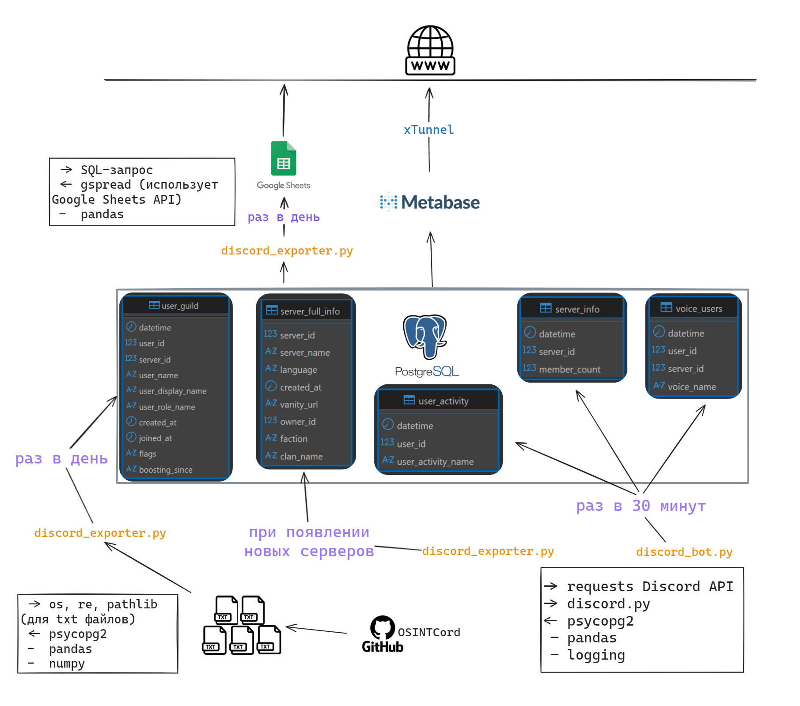
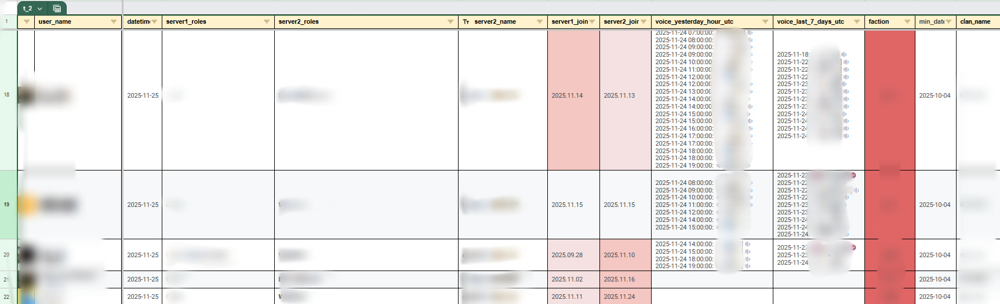
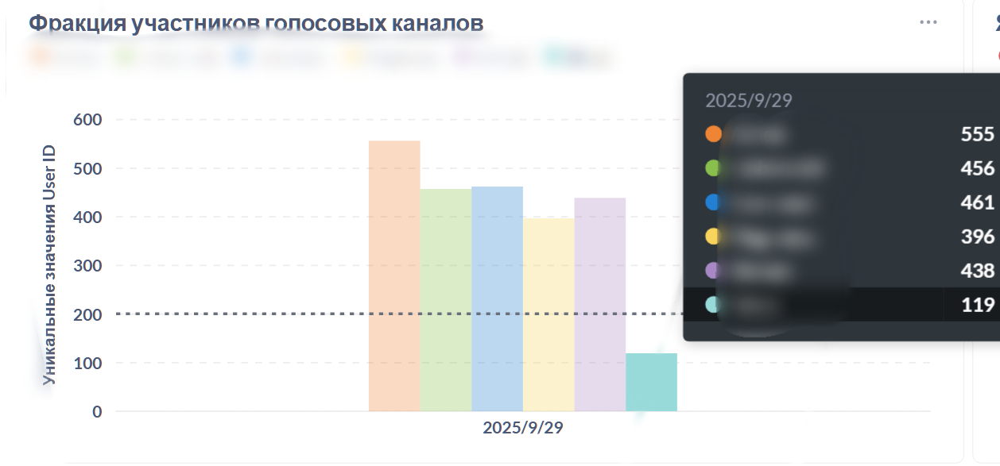
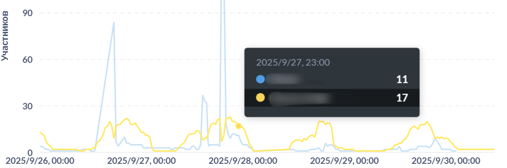

## Описание проекта

Основная задача — централизованно собирать информацию об активности серверов и голосовых каналов для последующего анализа нагрузки, онлайна и общей динамики активности.

Данные приходят через:
1. Discord API и discord.py (раз в 30 минут)
2. Ежедневный парсинг через модифицированный [OSINTCord](https://github.com/MrBoombastic/OSINTCord) 

Немного обрабатываются и складываются в PostgreSQL, откуда делаются выборки для Excel и для визуализации в Metabase.

**Схематично это выглядит так:**

---

## Описание работы

У меня есть два отдельных скрипта, которые запускаются по расписанию:

### 1. [`discord_bot.py`](https://github.com/JaffiSuman/Discord-Data-Collection-and-Analytics-System/blob/main/discord_bot.py) (каждые 30 минут)

Этот скрипт:

* проходит по заранее заданому списку серверов
* получает список голосовых каналов (полный, включая скрытые)
* смотрит, кто сейчас находится в голосе (включая скрытые)
* дополнительно собирает:

  * активность пользователей (во что играют)
  * общее количество участников сервера 

Данные собираются в память и потом пачкой отправляются в PostgreSQL.

Важно:

* используются асинхронные запросы (`aiohttp`)
* есть обработка rate limit (ответ 429)
* есть retry при сетевых ошибках
* данные собираются полные и чистые
* общее количество участников сервера можно вывести через второй .py скрипт этого проекта, который о каждом участнике собирает информацию, но для ускорения некоторых визуализаций выборок в Metabase специально создана отдельная таблица server_info
* batch insert через `executemany`
* есть логгирование операций в отдельный файл 

---

### 2. [`discord_exporter.py`](https://github.com/JaffiSuman/Discord-Data-Collection-and-Analytics-System/blob/main/discord_exporter.py) (раз в день)

Этот скрипт работает с логами, которые генерирует отдельный Node.js инструмент OSINTCord.

Работа скрипта такая:

* сначала запускается внешний процесс (`npm start`) 
* он генерирует `.txt` файлы с данными
* дальше Python-скрипт читает эти файлы и обрабатывает их

Что происходит при обработке:

* читаются все файлы из папки `/logs`
* данные объединяются в общий DataFrame
* добавляются служебные поля (datetime, server_id)
* чистятся роли (убираются лишние префиксы)
* удаляются строки с ботами
* приводятся типы и значения (`NaN → None`)

После этого данные загружаются в PostgreSQL.

Отдельно:

* исходные файлы после обработки удаляются (чтобы не обрабатывать повторно)

---

## Хранение данных

Все данные складываются в PostgreSQL (одна база, несколько таблиц):

* `voice_users` — информация об активности голосовых каналов
* `user_activity` — информация об игровой активности
* `server_info` — размер серверов
* `user_guild` — данные из логов (роли, участие и т.д.)
* `server_full_info` — вся доступная через API информация о сервере discord
  
---

## Запросы к базе

После загрузки всех данных:

* выполняется SQL-запрос [user_guild_voice_on_server_one](https://github.com/JaffiSuman/Discord-Data-Collection-and-Analytics-System/blob/main/user_guild_voice_on_server_one.sql) (лежит в отдельном `.sql` файле)
* результат забирается в pandas
* и отправляется в Google Sheets
  
Этот мегабольшой неоптимизированный запрос ищет пользователей из сервера 1, которые были в голосовых каналах любого другого сервера за последние 7 дней и последний день и имели роли отличные от стандартных, запрос показывает информацию за последние сутки почасовую и за последнюю неделю ежедневную.

Примерно так выглядит:

Metabase из коробки подключена к базе и так же запрашивает различные данные у нее. Metabase имеет собственный конструктор SQL запросов, данные в запросах могут ограничиваться выбранными пользователем фильтрами и поиском.
Есть три вкладки с визуализациями: 
сервера discord в общем, детально один сервер и пользователь. 

Примерно так выглядит:

Для представления объема собираемых данных:

---

## Что можно улучшить

* добавить нормальную оркестрацию (например, Airflow)
* привести в порядок за что отвечает конкретный .py скрипт, больше ООП для возможности дальнейшего дополнения и улучшения
* если база будет действительно большой - проверить на сложных запросов к базе при помощи анализа EXPLAIN тяжнлые места и попытаться ускорить, партиционирование для voice_users (как минимум один запрос собирает данные понедельно), проверить правильность расставленых индексов
  
---

## Зачем это вообще

Проект создавался как исследовательская система для анализа активности Discord-сообществ.

Основные задачи:

* анализ временных паттернов активности
* анализ нагрузки голосовых каналов
* исследование динамики серверов
* построение визуализаций и аналитических отчётов

Это можно использовать, например, для:

* планирования активности
* роста сообщества
* координации внутри игровых команд

---

`Проект создан исключительно в исследовательских и образовательных целях.`

